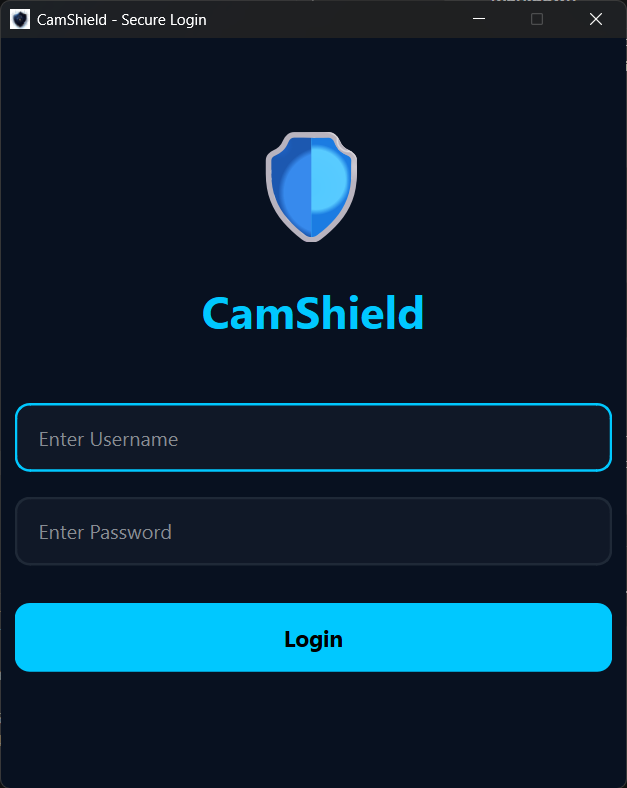
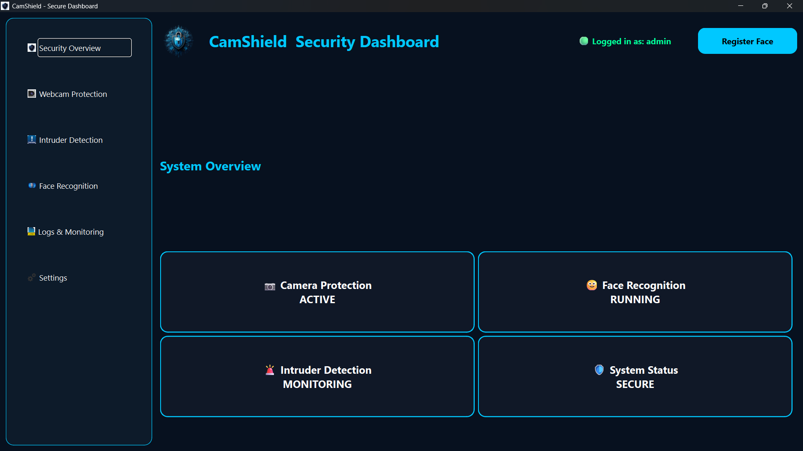
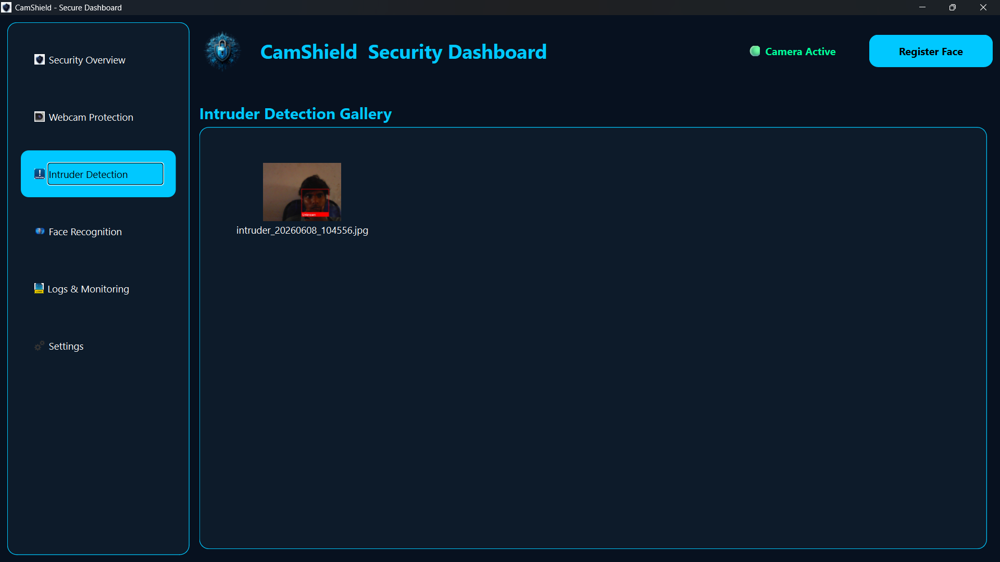

# 🛡️ CamShield

<div align="center">

# Webcam Security & Intrusion Detection System

Protecting Privacy Through Intelligent Webcam Security


</div>

---

## 📌 Project Overview

CamShield is a cybersecurity-focused desktop application developed using Python, PyQt6, OpenCV, and Face Recognition technology.

The system continuously monitors webcam activity and verifies the identity of users in real time. If an unauthorized person is detected, CamShield automatically captures the intruder image, stores encrypted logs, and sends email notifications to the administrator.

This project enhances privacy protection and helps prevent unauthorized access to computer systems.

---

## ✨ Key Features

* 🔐 Secure User Authentication
* 👤 Face Registration
* 🎯 Face Recognition
* 📷 Real-Time Webcam Monitoring
* 🚨 Intruder Detection
* 📸 Automatic Intruder Image Capture
* 📧 Email Alert Notifications
* 🔒 Encrypted Security Logs
* 🖥️ Security Dashboard
* ⚙️ Admin Management
* 🛡️ Webcam Protection System

---

## 🎯 Objectives

* Protect webcam access from unauthorized users
* Verify user identity using Face Recognition
* Detect intruders in real time
* Generate automated security alerts
* Maintain encrypted security logs
* Improve user privacy and cybersecurity

---

## 🏗️ System Architecture

```text
User
 │
 ▼
Authentication
 │
 ▼
Dashboard
 │
 ▼
Webcam Monitoring
 │
 ▼
Face Recognition
 │
 ├── Authorized User
 │         │
 │         ▼
 │    Access Granted
 │
 └── Intruder
           │
           ▼
    Capture Image
           │
           ▼
      Encrypt Logs
           │
           ▼
      Email Alert
```

---

## 🛠️ Technology Stack

| Technology       | Purpose                      |
| ---------------- | ---------------------------- |
| Python 3.11      | Core Programming             |
| PyQt6            | GUI Development              |
| OpenCV           | Webcam Monitoring            |
| Face Recognition | Face Detection & Recognition |
| Dlib             | Face Encoding                |
| bcrypt           | Password Security            |
| Cryptography     | Data Encryption              |
| SQLite / JSON    | Data Storage                 |
| SMTP             | Email Notifications          |
| NumPy            | Image Processing             |
| PyInstaller      | EXE Deployment               |

---

## 📂 Project Structure

```text
CamShield/
│
├── app/
│   ├── auth/
│   ├── security/
│   ├── ui/
│   ├── webcam/
│   └── database/
│
├── assets/
├── docs/
├── screenshots/
├── requirements.txt
├── run.py
└── README.md
```

---

## 📷 Application Screenshots

### 🔐 Login Window

Secure login interface for authorized users.



---

### 🖥️ Security Dashboard

Centralized dashboard for monitoring security status.



---

### 🚨 Intruder Detection

Automatically captures and stores intruder images.



---

## ⚙️ Installation

### Clone Repository

```bash
git clone https://github.com/harshavardhanthota0/CamShield.git
cd CamShield
```

### Install Dependencies

```bash
pip install -r requirements.txt
```

### Run Application

```bash
python run.py
```

---

## 📦 Release

Download the latest release from:

👉 **Releases → CamShield v1.0**

Includes:

* CamShield.exe
* Installation Instructions
* Project Documentation

---

## 📄 Documentation

Available in the `docs/` folder:

* Project Report
* Presentation Slides
* System Architecture Diagram
* Use Case Diagram
* Class Diagram
* Sequence Diagram
* Activity Diagram
* Component Diagram
* ER Diagram

---

## 🚀 Future Enhancements

* Cloud Storage Integration
* Mobile Notifications
* Multi-Factor Authentication
* AI-Based Threat Detection
* Real-Time Analytics Dashboard
* Cross-Platform Support

---

## 👨‍💻 Developer

**Harsha Vardhan Thota**

Cyber Security & Software Development Enthusiast

GitHub: https://github.com/harshavardhanthota0

---

## ⭐ Project Status

**Version:** v1.0

**Status:** Stable Release

**Platform:** Windows 10 / Windows 11

---

## 🛡️ CamShield

**Protecting Privacy Through Intelligent Webcam Security**
